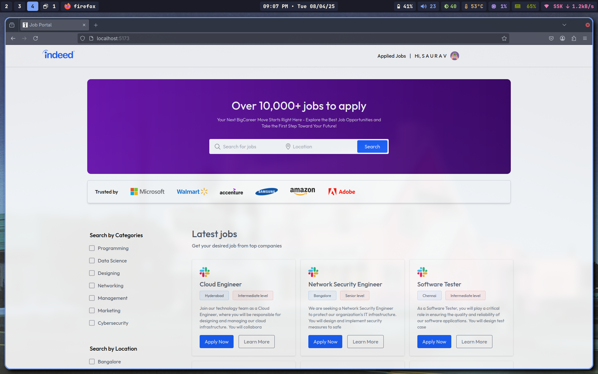

# Job Portal

A modern job portal application built with React, TypeScript, Node.js and MongoDB.

### 🌐 Preview

## Tech Stack

### _`Frontend`_

- **Frontend**: React, TypeScript
- **Styling**: TailwindCSS
- **State Management**: React Context API
- **Authentication**: Clerk (for users), JWT (for companies)
- **Routing**: React Router
- **HTTP Client**: Axios

### _`Backend`_

- **Runtime**: Node.js with Express
- **Database**: MongoDB with Mongoose ODM
- **Authentication**: Clerk (for users), JWT (for companies)
- **File Storage**: Cloudinary

## Features

### For Job Seekers

- Create and manage your professional profile
- Upload and update your resume
- Browse and search for jobs by title location
- Apply to jobs with a single click
- Track application status (Pending, Accepted , Rejected)
- View job details including salary, location, and requirements

### For EMployers/Recruiters

- Company registration and login
- Post and manage job listings
- Control job visibility (show/hide listings)
- Review applicants and their resumes
- Accep or reject job applications
- Track number of applicants per job
